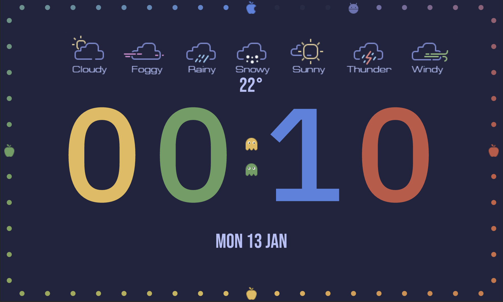
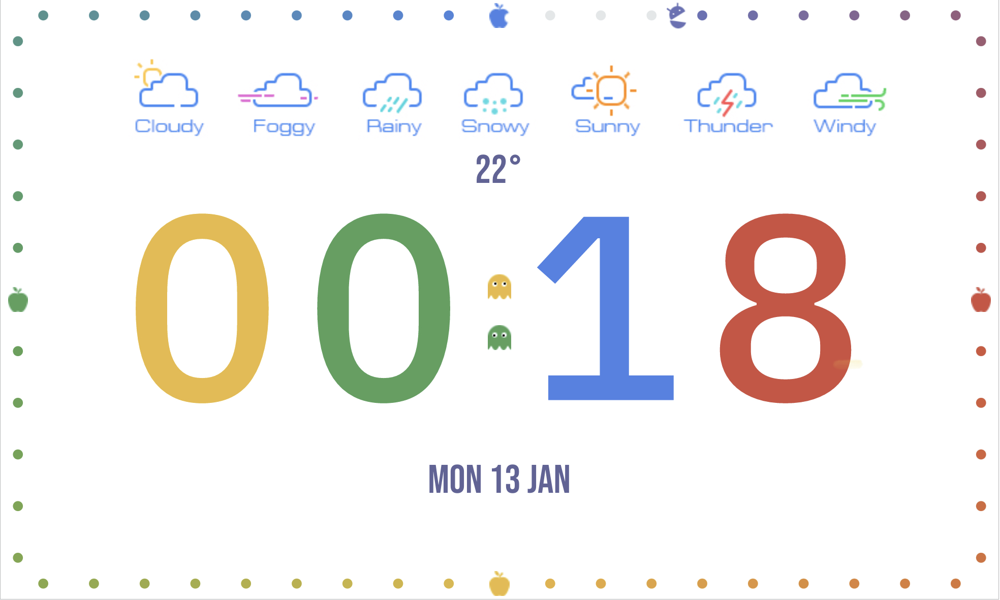

# baki_clock

Google the Flutter Clock challenge project.

## Getting Started

- flutter channel stable
- flutter upgrade
- cd baki_clock
- flutter create .
- flutter run (on Android or iOS in landscape)

Build a beautiful clock face UI with Flutter for the Lenovo Smart Clock.
Developed for pac man 40th anniversary. Inspired by pac man and Google logos.
It has a light theme and a dark theme, displays sample weather, droid inspired by (Android and Pac man), ghost, apples, and pellets.

