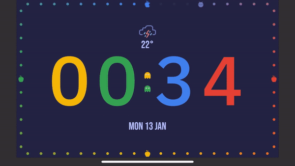

# baki_clock

Google The Flutter Clock challenge project.

## Getting Started

flutter channel stable
flutter upgrade
unzip <project>.zip
cd <name>_clock
flutter create .
flutter run (on Android or iOS in landscape)

Build a beautiful clock face UI with Flutter for the Lenovo Smart Clock.
Developed for pac man 40th anniversary. Inspired by pac man and Google logo colors.
It has a light theme and a dark theme, displays sample weather, pac man, ghost, apples, and pellets.

